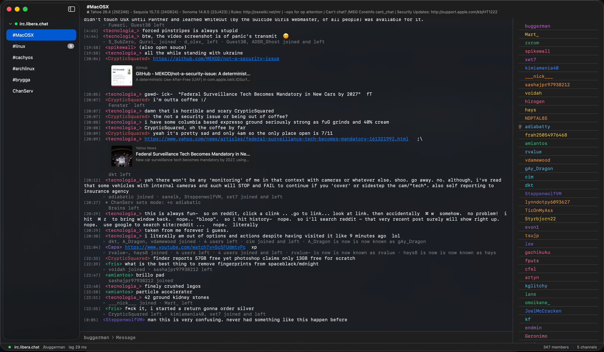

# Brygga

A modern, fast, feature-rich IRC client for macOS — built with Swift and SwiftUI.

Brygga is in early development. The core client works end-to-end (connect, join, send, receive, persist) but many features you'd expect from a mature IRC client are still missing.



## The name

**Brygga** (Swedish, /ˈbrʏɡːa/ — roughly *BRUEG-ah*, with the `y` pronounced like German `ü` or French `u`) is the Swedish word for a **pier, jetty, or gangway** — the wooden walkway that connects the shore to a boat. A fitting name for a client whose job is to be the plank you walk across to reach the IRC networks on the other side.

The same word also means *to brew* as a verb (as in beer), which is a nice coincidence given IRC culture.

## Requirements

- macOS 15 Sequoia or later (looks best on macOS 26 with Liquid Glass materials, but falls back gracefully to the standard `.bar` / `.thinMaterial` / `.regularMaterial` surfaces on earlier releases)
- Apple Silicon (arm64) for the official DMGs. Intel (x86_64) is source-compatible but not shipped — see [Building for Intel Macs](#building-for-intel-macs) to compile your own.
- Xcode 26 or later (for building from source)
- Swift 6.0+

## Download

Brygga ships on two tracks:

- **Stable** — [latest release](https://github.com/buggerman/Brygga/releases/latest). Cut manually from a `v*` tag; changes infrequently. Use this unless you want the cutting edge.
- **Nightly** — [`releases/tag/nightly`](https://github.com/buggerman/Brygga/releases/tag/nightly). Rebuilt on every push to `main`; the tag is deleted and recreated each time so the URL is always current. Marked prerelease. Expect rough edges between commits.

Either way, grab the `.dmg`, drag **Brygga.app** to `/Applications`, then right-click → **Open** on first launch (the binary is ad-hoc signed, not Developer-ID notarized).

If Gatekeeper refuses to open it even after right-click → Open (e.g. *"Apple could not verify Brygga is free of malware"*), strip the quarantine attribute once and retry:

```sh
xattr -cr /Applications/Brygga.app
```

## Building

```sh
# Library + executable
swift build

# Run tests
swift test

# Produce a runnable .app bundle at build/Brygga.app
./Scripts/build-app.sh

# Launch
open build/Brygga.app
```

A raw `swift run Brygga` launches the binary as a background process — it will not open a window. Always run the built `.app` bundle.

### Building for Intel Macs

Official DMGs are Apple Silicon only. The source has no Apple-Silicon-specific dependencies, so you can produce a working Intel (x86_64) binary yourself — there's just no prebuilt artifact shipped by the project. No CI coverage either, so it's best-effort.

**Requirements:** macOS 15 Sequoia or later (Intel Macs still on macOS 15's compatibility list), Xcode 26 / Swift 6.2 toolchain.

**On an Intel Mac** — the normal flow already targets x86_64:

```sh
swift build -c release
./Scripts/build-app.sh release
open build/Brygga.app
```

**Cross-compile from Apple Silicon** — override the host triple:

```sh
swift build -c release --triple x86_64-apple-macosx15.0
# then build the .app around the cross-compiled binary manually:
mkdir -p build/Brygga.app/Contents/MacOS build/Brygga.app/Contents/Resources
cp .build/x86_64-apple-macosx/release/Brygga build/Brygga.app/Contents/MacOS/Brygga
cp Resources/AppIcon.icns build/Brygga.app/Contents/Resources/AppIcon.icns
# then copy an Info.plist from Scripts/build-app.sh's heredoc by hand,
# or tweak build-app.sh to point at the x86_64 artifact path
```

We don't test Intel builds in CI, so if something breaks on x86_64 specifically, please open an issue with the full build output. Bugs will be fixed when reasonable; platform-specific workarounds won't be.

## Current capabilities

Brygga already covers everything a mIRC daily-driver expects, minus DCC and the mIRC scripting language. A non-exhaustive summary:

- TLS-by-default on 6697 via Network.framework, auto-reconnect with exponential backoff, outbound flood protection
- SASL **EXTERNAL** (TLS client certificate), **SCRAM-SHA-256** (RFC 7677), or **PLAIN** — auto-selected based on what the server advertises
- IRCv3 caps: `server-time`, `multi-prefix`, `userhost-in-names`, `chghost`, `account-tag` / `account-notify`, `away-notify`, `invite-notify`, `batch`, `chathistory` / `draft/chathistory`, `message-tags`
- Slash commands: `/join`, `/part`, `/nick`, `/me`, `/msg`, `/query`, `/topic`, `/whois`, `/away`, `/invite`, `/ignore`, `/notify`, `/list`, `/perform`, plus raw fallthrough
- Two-column `NavigationSplitView` with auto-hiding user-list inspector, detachable channel windows (`Cmd+Shift+D`), pinned favorites (`Cmd+1…9`), quick switcher (`Cmd+K`), quick join (`Cmd+J`), prev/next channel (`Cmd+[` / `Cmd+]`), in-buffer find (`Cmd+F`), cross-channel find (`Cmd+Shift+F`), tab nick completion, emoji autocomplete (`:smile:` → 😄)
- IRCv3 typing indicator (`+typing` TAGMSG), inline OG / image link previews, mIRC control-code rendering, markdown-style input (`*bold*` / `_italic_` / `~strike~`), stable per-nick colors, highlight notifications with Dock badge, per-channel line marker, status bar with live lag, Liquid Glass chrome across chat, sidebar, and windows
- Preferences: show-joins/parts, auto-join-on-invite, link-previews, identity defaults, timestamp format, colorize nicknames, highlight keywords, ignore list, disk logging, saved servers
- Persistence: servers + channels + preferences in `~/Library/Application Support/Brygga`, scrollback as JSONL, opt-out plain-text logs under `~/Library/Logs/Brygga/`

Full list and what's still on the backlog lives in [docs/PARITY.md](docs/PARITY.md).

## Roadmap

Phase 1 / 2 / 3 of the [mIRC parity plan](docs/PARITY.md) are shipped. Further polish will surface from daily driving the client.

### Explicitly out of scope

- DCC file transfer (see [PARITY.md](docs/PARITY.md) for the full "out of scope" list)
- Objective-C or C interop — see [AGENTS.md](AGENTS.md)

## Architecture

Brygga is split into two Swift Package Manager targets:

- `BryggaCore` — library. IRC protocol parser, `IRCConnection` actor (network I/O), `IRCSession` (`@MainActor`, wraps the connection and mutates `@Observable` models), persistence.
- `Brygga` — executable. SwiftUI views and the `@main` entry point.

Models (`Server`, `Channel`, `User`, `Message`) are `@Observable` and live on the main actor. The `actor`/`@MainActor` boundary is crossed via `AsyncStream` for incoming IRC messages and connection state changes.

Configuration lives in `~/Library/Application Support/Brygga/servers.json`.

## Contributing

See [AGENTS.md](AGENTS.md) for the rules AI coding agents (and humans) should follow when working in this repo.

The mIRC feature-parity plan — what's in scope, out of scope, and in what order — lives in [docs/PARITY.md](docs/PARITY.md).

## Privacy

Brygga collects no data. Local config and scrollback stay on your Mac; chat traffic goes directly to whichever IRC networks you connect to. Full policy: [docs/PRIVACY.md](docs/PRIVACY.md).

## License

BSD 3-Clause. See source file headers.
